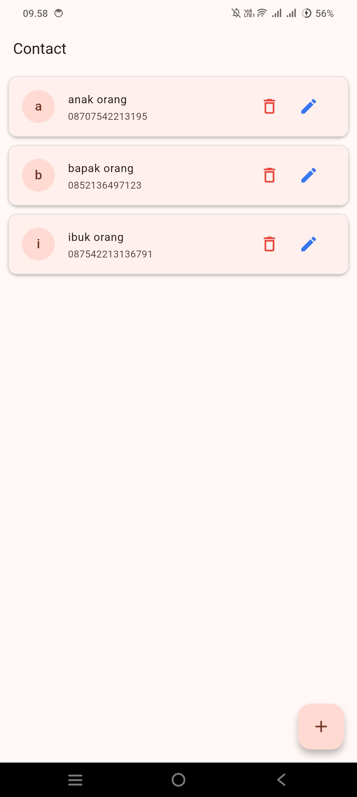
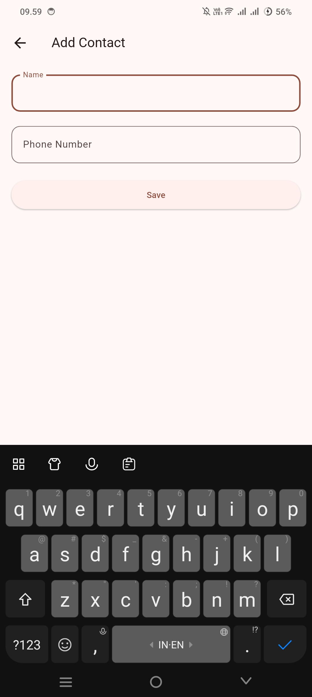

# 📱 Contact App

Aplikasi manajemen kontak sederhana berbasis Flutter dengan penyimpanan lokal menggunakan **Hive**. Mendukung operasi CRUD (Create, Read, Update, Delete) penuh untuk data kontak (nama & nomor telepon).

---

## ✨ Fitur

- 📇 **Daftar Kontak**: Menampilkan seluruh kontak tersimpan dalam bentuk `Card` list yang reaktif (otomatis update via `ValueListenableBuilder` + Hive `Box`).
- ➕ **Tambah Kontak**: Menambahkan kontak baru melalui Floating Action Button (FAB).
- ✏️ **Edit Kontak**: Memperbarui nama & nomor telepon kontak yang sudah ada.
- 🗑️ **Hapus Kontak**: Menghapus kontak langsung dari daftar.
- ✅ **Validasi Form**: Nama dan nomor telepon wajib diisi; input nomor telepon hanya menerima digit (`FilteringTextInputFormatter.digitsOnly`).
- 💾 **Penyimpanan Lokal**: Data disimpan secara persisten di perangkat menggunakan Hive (tidak memerlukan koneksi internet/backend).

---

## 📸 Screenshot

| Daftar Kontak | Tambah/Edit Kontak |
| :---: | :---: |
|  |  |

---

## 🛠️ Tech Stack

- **Framework**: [Flutter](https://flutter.dev/) (Dart SDK `^3.12.2`)
- **Bahasa**: Dart
- **State Management**: `StatefulWidget` / `ValueListenableBuilder` bawaan Flutter (tanpa package state management tambahan)
- **Local Database**: [Hive](https://pub.dev/packages/hive) & [hive_flutter](https://pub.dev/packages/hive_flutter)
- **Code Generation**: `hive_generator` + `build_runner` (untuk membuat `Contact` type adapter)
- **Linting**: `flutter_lints`

---

## 📂 Struktur Proyek

```
lib/
├── main.dart              # Entry point, inisialisasi Hive & MaterialApp
├── list_contact.dart      # Halaman daftar kontak (ListContact)
├── form_contact.dart      # Halaman form tambah/edit kontak (FormContact)
├── database/
│   └── db_helper.dart     # Helper CRUD ke Hive Box (DbHelper)
└── model/
    ├── contact.dart       # Model Contact (@HiveType/@HiveField)
    └── contact.g.dart     # Adapter hasil generate build_runner
```

---

## 🚀 Memulai

### Prasyarat

- [Flutter SDK](https://docs.flutter.dev/get-started/install) (teruji dengan Flutter 3.44.6 / Dart 3.12.2)
- Android Studio / VS Code beserta plugin Flutter & Dart
- Emulator Android/iOS atau perangkat fisik (aplikasi juga dapat dijalankan di Web, Windows, Linux, dan macOS karena platform folder sudah tersedia)

### Instalasi

1. **Clone repository**
   ```bash
   git clone https://github.com/indriani-xx/contact_app.git
   cd contact_app
   ```

2. **Install dependencies**
   ```bash
   flutter pub get
   ```

3. **Generate Hive adapter** (diperlukan jika `model/contact.dart` diubah atau `contact.g.dart` belum ada)
   ```bash
   dart run build_runner build --delete-conflicting-outputs
   ```

4. **Jalankan aplikasi**
   ```bash
   flutter run
   ```

### Menjalankan Test

Proyek ini memiliki widget test untuk memastikan form edit terisi otomatis dengan data kontak yang ada:

```bash
flutter test
```

---

## 📦 Dependencies Utama

| Package | Kegunaan |
| --- | --- |
| `hive` | Penyimpanan key-value NoSQL lokal |
| `hive_flutter` | Integrasi Hive dengan Flutter (inisialisasi, `ValueListenableBuilder`) |
| `cupertino_icons` | Set ikon gaya iOS |
| `hive_generator` *(dev)* | Generator adapter Hive dari anotasi `@HiveType`/`@HiveField` |
| `build_runner` *(dev)* | Menjalankan proses code generation |
| `flutter_lints` *(dev)* | Aturan lint standar Flutter |

---

## 📄 Lisensi

Proyek ini dibuat untuk keperluan pembelajaran/pribadi dan belum dipublikasikan ke pub.dev (`publish_to: 'none'`).
